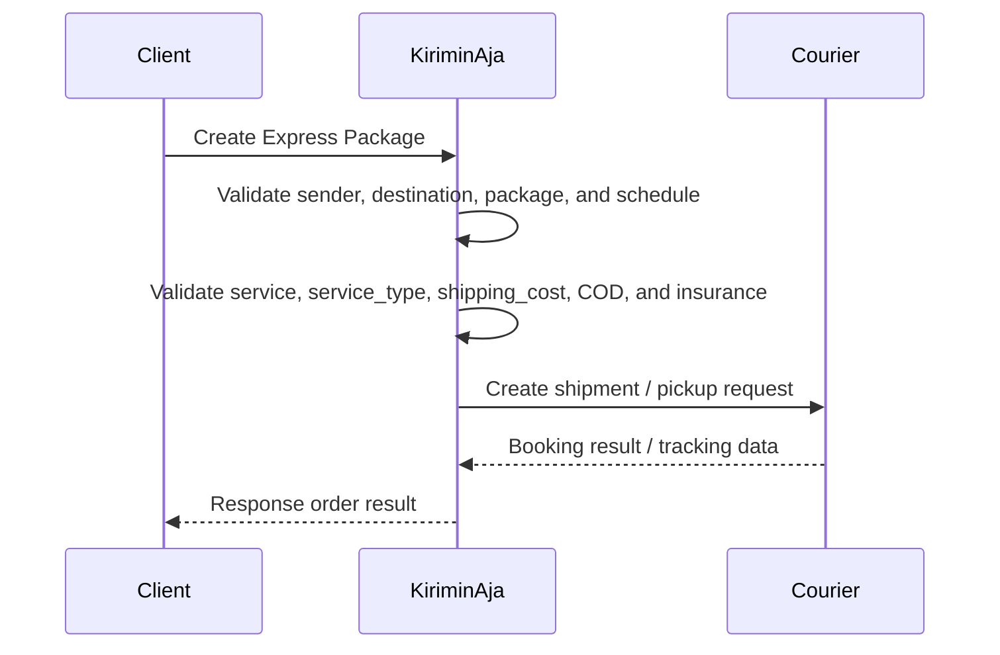

### Supported Couriers

Courier code is sent through the `service` field inside each package. Example:

- `jnt`

> Use the courier code and `service_type` returned by the pricing/check tariff endpoint.

### v6.2 Highlights

- Pickup schedule support through `schedule`
- Sender location support through `kecamatan_id`, `kelurahan_id`, `latitude`, and `longitude`
- Destination location support through `destination_kecamatan_id`, `destination_kelurahan_id`, `destination_latitude`, and `destination_longitude`
- Package dimension support through `weight`, `width`, `height`, and `length`
- Item-level metadata support through `items[].metadata`
- COD support through `cod`
- Insurance support through `insurance_amount`

---

## Authentication

All requests must include a bearer token.

```http
Content-Type: application/json
Authorization: Bearer <token>
```

---

## Order Flow



### Flow Summary

1. Client sends pickup information and package list.
2. KiriminAja validates sender address, pickup coordinate, and location IDs.
3. KiriminAja validates destination address, destination coordinate, and service data.
4. KiriminAja validates package dimensions, item value, shipping cost, COD, and insurance amount.
5. KiriminAja creates the shipment or pickup request to the selected courier.
6. Client receives the order creation result.

---

# Request Payload

## Top-Level Payload: Pickup / Sender Details

| Field           |                Type | Nullable | Description                                                   |
| --------------- | ------------------: | :------: | ------------------------------------------------------------- |
| `address`       |              string |    No    | Sender / pickup full address                                  |
| `phone`         |              string |    No    | Sender phone number. Use `08...` or `62...` format            |
| `kecamatan_id`  |             integer |    No    | Sender district/subdistrict ID from KiriminAja location data  |
| `kelurahan_id`  |             integer |    No    | Sender village/urban-village ID from KiriminAja location data |
| `latitude`      |             numeric |    No    | Sender pickup latitude                                        |
| `longitude`     |             numeric |    No    | Sender pickup longitude                                       |
| `platform_name` |              string |   Yes    | Partner platform name, for example `shopify`                  |
| `name`          |              string |    No    | Sender name                                                   |
| `zipcode`       |              string |    No    | Sender postal code                                            |
| `schedule`      |    string, datetime |    No    | Pickup schedule in `YYYY-MM-DD HH:mm:ss` format               |
| `packages`      | array, min 1 object |    No    | List of package objects to be created                         |

---

## Package Object

| Field                      |                Type | Nullable | Description                                                      |
| -------------------------- | ------------------: | :------: | ---------------------------------------------------------------- |
| `order_id`                 |              string |    No    | Partner-side order ID. Must be unique per order                  |
| `destination_name`         |              string |    No    | Recipient name                                                   |
| `destination_phone`        |              string |    No    | Recipient phone number                                           |
| `destination_address`      |              string |    No    | Recipient full address                                           |
| `destination_kecamatan_id` |             integer |    No    | Recipient district/subdistrict ID from KiriminAja location data  |
| `destination_kelurahan_id` |             integer |    No    | Recipient village/urban-village ID from KiriminAja location data |
| `destination_zipcode`      |              string |    No    | Recipient postal code                                            |
| `destination_latitude`     |             numeric |    No    | Recipient latitude                                               |
| `destination_longitude`    |             numeric |    No    | Recipient longitude                                              |
| `weight`                   |             integer |    No    | Package weight in grams                                          |
| `width`                    |             integer |    No    | Package width in centimeters                                     |
| `height`                   |             integer |    No    | Package height in centimeters                                    |
| `length`                   |             integer |    No    | Package length in centimeters                                    |
| `qty`                      |             integer |    No    | Package quantity                                                 |
| `item_value`               |             integer |    No    | Total declared item value in Rupiah                              |
| `shipping_cost`            |             integer |    No    | Shipping cost returned from pricing/check tariff endpoint        |
| `service`                  |              string |    No    | Courier code, for example `jnt`                                  |
| `insurance_amount`         |             integer |   Yes    | Insurance amount in Rupiah. Use `0` when not using insurance     |
| `service_type`             |              string |    No    | Courier service type, for example `EZ`                           |
| `cod`                      |             integer |   Yes    | COD amount in Rupiah. Use `0` when not using COD                 |
| `package_type_id`          |             integer |    No    | Package type ID. Example: `7`                                    |
| `item_name`                |              string |    No    | Main item name                                                   |
| `drop`                     |             boolean |   Yes    | Drop-off flag. Use `false` for pickup flow                       |
| `note`                     |              string |   Yes    | Additional package note                                          |
| `items`                    | array, min 1 object |    No    | Package item details                                             |

---

## Items Object

| Field      |    Type | Nullable | Description                   |
| ---------- | ------: | :------: | ----------------------------- |
| `name`     |  string |    No    | Item name                     |
| `price`    | integer |    No    | Item price per unit in Rupiah |
| `weight`   | integer |    No    | Item weight in grams          |
| `width`    | integer |    No    | Item width in centimeters     |
| `height`   | integer |    No    | Item height in centimeters    |
| `length`   | integer |    No    | Item length in centimeters    |
| `qty`      | integer |    No    | Item quantity                 |
| `metadata` |  object |   Yes    | Free-form partner metadata    |

---

## Metadata Object

| Field           |   Type | Nullable | Description        |
| --------------- | -----: | :------: | ------------------ |
| `sku`           | string |   Yes    | Partner item SKU   |
| `variant_label` | string |   Yes    | Item variant label |

---

## Phone Validation

The phone number will be stripped of spaces and - characters before validation.

Accepted formats:

| Prefix | Pattern           | Description                            |
| ------ | ----------------- | -------------------------------------- |
| `08`   | `^08\d{8,12}$`    | Local mobile phone number.             |
| `02`   | `^02\d{7,11}$`    | Local landline phone number.           |
| `628`  | `^628\d{8,12}$`   | Indonesian national phone number.      |
| `+628` | `^\+628\d{8,12}$` | Indonesian international phone number. |

# Request Body Example

```json
{
  "address": "Jl. Palagan Tentara Pelajar No.KM. 7 No. 77, RT.001/RW.033, Sedan, Sariharjo, Kec. Ngaglik, Kabupaten Sleman, Daerah Istimewa Yogyakarta 55581",
  "phone": "6282200000000",
  "kecamatan_id": 5788,
  "kelurahan_id": 31554,
  "latitude": -7.7393368,
  "longitude": 110.3734844,
  "platform_name": "shopify",
  "name": "TESTING",
  "zipcode": "55581",
  "schedule": "2026-04-28 16:00:00",
  "packages": [
    {
      "order_id": "DEVX-0000000000001",
      "destination_name": "PENERIMA TESTING",
      "destination_phone": "6282200000000",
      "destination_address": "Jl. Danau Ranau, Sawojajar, Kec. Kedungkandang, Kota Malang, Jawa Timur 65139",
      "destination_kecamatan_id": 3635,
      "destination_kelurahan_id": 46740,
      "destination_zipcode": "65139",
      "destination_latitude": -7.976862,
      "destination_longitude": 112.6564411,
      "weight": 1000,
      "width": 10,
      "height": 10,
      "length": 10,
      "qty": 1,
      "item_value": 100000,
      "shipping_cost": 16000,
      "service": "jnt",
      "insurance_amount": 0,
      "service_type": "EZ",
      "cod": 0,
      "package_type_id": 7,
      "item_name": "iPhone 17 Pro Max 2TB",
      "drop": false,
      "note": "iPhone Sangar",
      "items": [
        {
          "name": "iPhone 17 Pro Max 2TB",
          "price": 1000000,
          "weight": 1000,
          "width": 10,
          "height": 10,
          "length": 10,
          "qty": 1,
          "metadata": {
            "sku": "2531030304",
            "variant_label": "2TB"
          }
        }
      ]
    }
  ]
}
```
