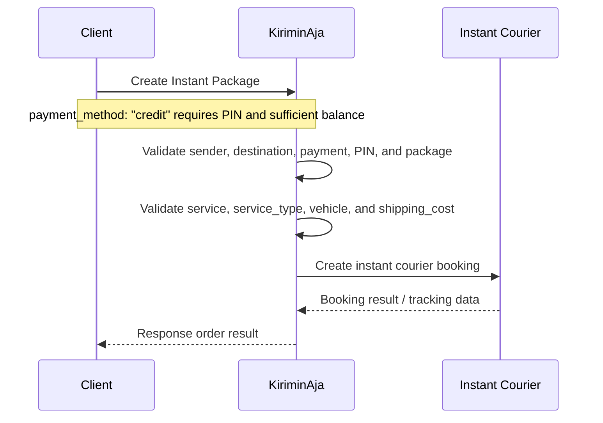

### Supported Couriers

Courier code is sent through the `service` field inside each package. Examples:

- `gosend`
- `grab_express`
- `borzo`

> Use the courier code and `service_type` returned by the pricing/check tariff endpoint.

### v6.2 Highlights

- KA Credit payment support through `payment_method: "credit"`
- PIN validation through `pin` when using KA Credit
- Nested recipient data through `packages[].destination`
- Vehicle selection through `vehicle`
- Insurance type support through `insurance_type`
- Multi-item package support through `items`

---

## Important KA Credit Note

> When using `payment_method: "credit"`, ensure the KA Credit balance is at least equal to the `shipping_cost` of the package. If the balance is insufficient, the request may be rejected before courier booking is created.

---

## Authentication

All requests must include a bearer token.

```http
Authorization: Bearer <token>
Content-Type: application/json
```

---

## Order Flow



### Flow Summary

1. Client sends pickup information and package list.
2. KiriminAja validates sender address and pickup coordinate.
3. If `payment_method` is `credit`, KiriminAja validates `pin` and KA Credit balance.
4. KiriminAja validates destination object, instant courier service, vehicle type, and shipping cost.
5. KiriminAja creates an instant booking with the selected courier.
6. Client receives the order creation result.

---

# Request Payload

## Top-Level Payload: Pickup / Sender Details

| Field            |                   Type |  Nullable   | Description                                        |
| ---------------- | ---------------------: | :---------: | -------------------------------------------------- |
| `address`        |                 string |     No      | Sender / pickup full address                       |
| `phone`          |                 string |     No      | Sender phone number. Use `08...` or `62...` format |
| `latitude`       |                numeric |     No      | Sender pickup latitude                             |
| `longitude`      |                numeric |     No      | Sender pickup longitude                            |
| `name`           |                 string |     No      | Sender name                                        |
| `zipcode`        |                 string |     Yes     | Sender postal code                                 |
| `payment_method` | enum: `credit`, `cash` |     Yes     | Payment method. Use `credit` for KA Credit         |
| `pin`            |       string, 6 digits | Conditional | Required when `payment_method` is `credit`         |
| `packages`       |    array, min 1 object |     No      | List of package objects to be created              |

---

## Package Object

| Field             |                Type | Nullable | Description                                               |
| ----------------- | ------------------: | :------: | --------------------------------------------------------- |
| `order_id`        |              string |    No    | Partner-side order ID. Must be unique per order           |
| `destination`     |              object |    No    | Recipient destination object                              |
| `insurance_type`  |                enum |   Yes    | Currently instant can't support insurance allowance       |
| `shipping_cost`   |             integer |    No    | Shipping cost returned from pricing/check tariff endpoint |
| `service`         |              string |    No    | Instant courier code, for example `gosend`                |
| `service_type`    |              string |    No    | Instant service type, for example `instant`               |
| `package_type_id` |             integer |    No    | Package type ID. Example: `7`                             |
| `vehicle`         |              string |    No    | Vehicle type. Example: `motor`                            |
| `items`           | array, min 1 object |    No    | Package item details                                      |

---

## Destination Object

| Field          |    Type | Nullable | Description                       |
| -------------- | ------: | :------: | --------------------------------- |
| `name`         |  string |    No    | Recipient name                    |
| `phone`        |  string |    No    | Recipient phone number            |
| `latitude`     | numeric |    No    | Recipient latitude                |
| `longitude`    | numeric |    No    | Recipient longitude               |
| `address`      |  string |    No    | Recipient full address            |
| `address_note` |  string |   Yes    | Additional recipient address note |

---

## Items Object

| Field         |    Type | Nullable | Description          |
| ------------- | ------: | :------: | -------------------- |
| `name`        |  string |    No    | Item name            |
| `description` |  string |   Yes    | Item description     |
| `price`       | integer |    No    | Item price in Rupiah |
| `weight`      | integer |    No    | Item weight in grams |

---

# Request Body Example

```json
{
  "address": "House of KKK",
  "phone": "628126870021",
  "latitude": -6.229512799999999,
  "longitude": 106.9059138,
  "name": "House of kk",
  "zipcode": "13430",
  "payment_method": "credit",
  "pin": "123456",
  "packages": [
    {
      "order_id": "ADDI-1000000041",
      "destination": {
        "name": "John Doe",
        "phone": "081234567890",
        "latitude": -6.2088,
        "longitude": 106.8456,
        "address": "Jl. Sudirman No. 123, Jakarta Pusat",
        "address_note": "Gedung A Lantai 5"
      },
      "insurance_type": "basic",
      "shipping_cost": 30500,
      "service": "gosend",
      "service_type": "instant",
      "package_type_id": 7,
      "vehicle": "motor",
      "items": [
        {
          "name": "Smartphone",
          "description": "Samsung Galaxy S24 Ultra",
          "price": 5000000,
          "weight": 750
        }
      ]
    }
  ]
}
```
